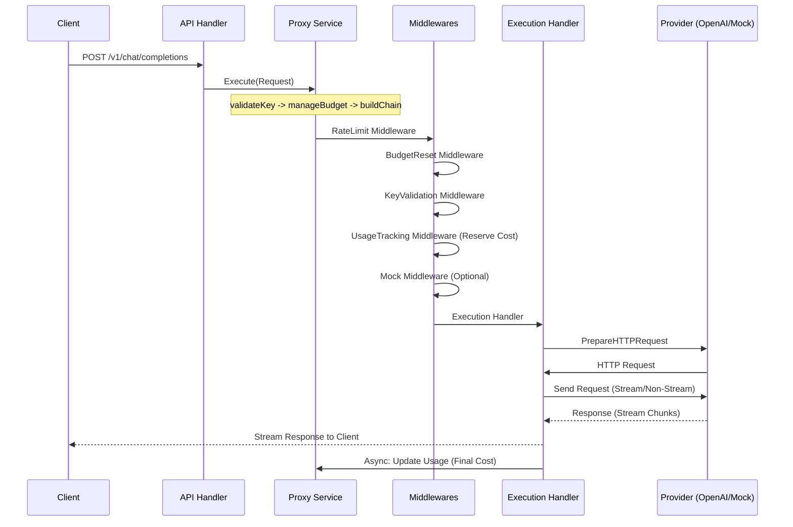

# Pouch-AI System Architecture (DDD)

## 1. Project Overview
**pouch-ai** is a self-hosted LLM proxy gateway designed for financial safety and extensibility. It uses a Domain-Driven Design (DDD) layered architecture to ensure clean separation of concerns and easy integration of new LLM providers.

## 2. Layered Architecture

### 2.1 Domain Layer (`backend/domain`)
The heart of the application, containing business logic and interfaces.
- **Key Domain**: Manages API keys, budgets, and rate limits.
- **Provider Domain**: Defines the abstraction for LLM backends (e.g., OpenAI, Mock).
- **Proxy Domain**: Defines the request/response flow using the **Chain of Responsibility** pattern.

### 2.2 Service Layer (`backend/service`)
Orchestrates domain entities to perform application-specific tasks.
- **KeyService**: Handles creation, validation, caching, and usage tracking of API keys.
- **ProxyService**: Decomposed into logical units (`validateKey`, `manageBudget`, `buildChain`) for better maintainability and observability.

### 2.3 Infrastructure Layer (`backend/infra`)
Concrete implementations of domain interfaces and external system interactions.
- **db**: SQLite implementation of the Key Repository.
- **provider**: implementations of LLM providers (OpenAI, Mock).
- **execution**: The final handler in the proxy chain that performs the actual HTTP requests.
- **pricing**: Token counting and pricing logic.

### 2.4 API & Cross-Cutting Concerns
- **API Handler**: Echo handlers for keys and proxying (`backend/api`).
- **Middleware**: Authentication, routing, and plugin-based logic.
- **Logging**: Centralized structured logging using Go's `log/slog` (`backend/util/logger`).

## 3. Plugin System
The system is designed for high extensibility through a decentralized plugin registration mechanism.

- **Decentralized Registration**: Each plugin (provider or middleware) registers itself via a `registry.go` file within its own package. This eliminates the need for hardcoded lists in the core engine.
- **Schema-Driven**: Plugins can define their configuration schemas, which are used by the frontend to dynamically generate configuration UIs.

## 4. Data Flow & Middleware Chain

The request processing pipeline uses a Chain of Responsibility pattern. When a request hits `/v1/chat/completions`:



## 5. Frontend Architecture
The frontend is built with Astro and Preact, following a modular and centralized approach.

- **Centralized API Client**: All backend communication is localized in `frontend/src/api/api.ts`, ensuring consistent error handling and type safety.
- **Shared UI Components**: Complex forms (like API key configuration) are extracted into shared components (`KeyForm.tsx`) to ensure a consistent UX across creation and editing flows.
- **Stateful Hooks**: Custom hooks (e.g., `usePluginInfo`) are used to manage shared stateful logic, such as fetching provider and middleware metadata.

## 6. Directory Structure

```text
pouch-ai/
├── cmd/pouch/                # Entry point (main.go)
├── backend/
│   ├── api/                  # API Layer (Handlers)
│   ├── database/             # DB Connection Setup
│   ├── domain/               # Domain Layer (Interfaces, Entities, Errors)
│   ├── infra/                # Infrastructure Layer (Impl: DB, Providers)
│   ├── plugins/              # Plugin Manager and Registries
│   ├── server/               # Server Bootstrap & Wiring
│   ├── service/              # Service Layer (Orchestration)
│   └── util/logger/          # Structured Logging System
├── frontend/
│   ├── src/api/              # Centralized API Client
│   ├── src/components/       # Modular UI Components
│   ├── src/hooks/            # Custom React Hooks
│   └── src/types.ts/         # Shared Type Definitions
└── data/                     # SQLite Database storage (runtime)
```

## 7. Technology Stack
- **Backend**: Go 1.25+ (Echo Framework, slog)
- **Frontend**: Astro + TailwindCSS + DaisyUI + Preact
- **Database**: SQLite (modernc.org/sqlite - CGO free)
- **Token Counting**: tiktoken-go
