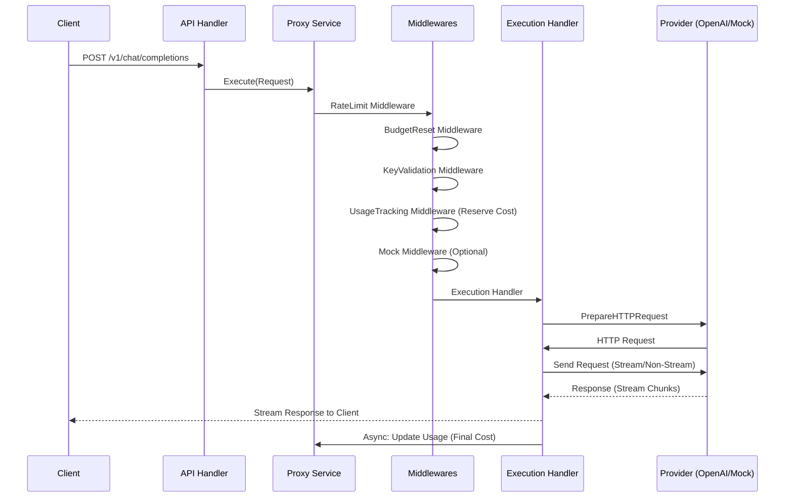

# Pouch-AI System Architecture (DDD)

## 1. Project Overview
**pouch-ai** is a self-hosted LLM proxy gateway designed for financial safety and extensibility. It uses a Domain-Driven Design (DDD) layered architecture to ensure clean separation of concerns and easy integration of new LLM providers.

## 2. Layered Architecture

### 2.1 Domain Layer (`backend/domain`)
The heart of the application, containing business logic and interfaces.
- **Key Domain**: Manages API keys, budgets, and rate limits.
- **Provider Domain**: Defines the abstraction for LLM backends (e.g., OpenAI, Mock).
- **Proxy Domain**: Defines the request/response flow using the **Chain of Responsibility** pattern.

### 2.2 Service Layer (`backend/service`)
Orchestrates domain entities to perform application-specific tasks.
- **KeyService**: Handles creation, validation, caching, and usage tracking of API keys.
- **ProxyService**: Orchestrates the proxy flow through a middleware chain.

### 2.3 Infrastructure Layer (`backend/infra`)
Concrete implementations of domain interfaces and external system interactions.
- **db**: SQLite implementation of the Key Repository.
- **provider**: implementations of LLM providers (OpenAI, Mock).
- **execution**: The final handler in the proxy chain that performs the actual HTTP requests.
- **pricing**: Token counting and pricing logic.

### 2.4 API Layer (`backend/api`)
Handles HTTP communication and presentation.
- **handler**: Echo handlers for keys and proxying.
- **middleware**: Authentication and routing logic.

## 3. Data Flow & Middleware Chain

The request processing pipeline uses a Chain of Responsibility pattern. When a request hits `/v1/chat/completions`:



## 4. Key Components

### 4.1 Budget Enforcement
Financial safety is the core feature.
1. **Reservation**: `UsageTrackingMiddleware` estimates the input cost and reserves it against the key's budget before execution.
2. **Execution**: The request is sent to the provider.
3. **Settlement**: After the response is complete (or stream finishes), the actual cost (input + output) is calculated. The reservation is adjusted to the final cost in the database.

### 4.2 Mock Provider
For testing and development without spending money, `infra.NewMockProvider` creates a local in-memory server.
- It intercepts requests designated for the "mock" provider.
- It simulates both streaming and non-streaming OpenAI-compatible responses.
- It has zero cost, allowing safe UI and integration testing.

## 5. Directory Structure

```text
pouch-ai/
├── cmd/pouch/                # Entry point (main.go)
├── backend/
│   ├── api/                  # API Layer (Handlers)
│   ├── database/             # DB Connection Setup
│   ├── domain/               # Domain Layer (Interfaces, Entities)
│   ├── infra/                # Infrastructure Layer (Impl: DB, Providers)
│   ├── server/               # Server Bootstrap & Wiring
│   └── service/              # Service Layer (Business Logic)
├── frontend/                 # Astro Frontend
└── data/                     # SQLite Database storage (runtime)
```

## 6. Technology Stack
- **Backend**: Go (Echo Framework)
- **Frontend**: Astro + TailwindCSS + DaisyUI + Preact
- **Database**: SQLite (modernc.org/sqlite - CGO free)
- **Token Counting**: tiktoken-go
