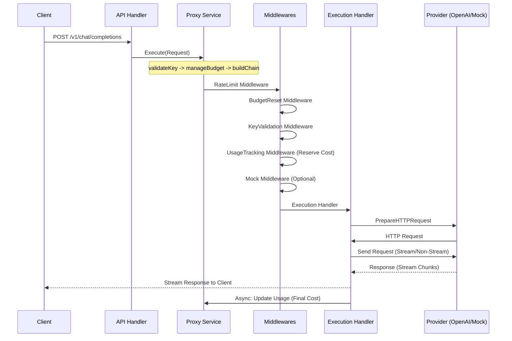

# Pouch-AI System Architecture (DDD)

## 1. Project Overview
**pouch-ai** is a self-hosted LLM proxy gateway designed for financial safety and extensibility. It uses a Domain-Driven Design (DDD) layered architecture to ensure clean separation of concerns and easy integration of new LLM providers.

## 2. Layered Architecture

### 2.1 Domain Layer (`backend/domain`)
The heart of the application, containing business logic and interfaces.
- **Key Domain**: Manages API keys, budgets, and rate limits.
- **Plugin Domain**: Consolidates plugin-related types (Schema, Field, Config, Info) and defines registry interfaces.
- **Provider Domain**: Defines the abstraction for LLM backends (e.g., OpenAI, Mock).
- **Proxy Domain**: Defines the request/response flow using the **Chain of Responsibility** pattern.

### 2.2 Service Layer (`backend/service`)
Orchestrates domain entities to perform application-specific tasks.
- **KeyService**: Handles creation, validation, caching, and usage tracking of API keys.
- **ProxyService**: Decomposed into logical units (`validateKey`, `manageBudget`, `buildChain`) for better maintainability and observability.

### 2.3 Infrastructure Layer (`backend/infra`)
Concrete implementations of domain interfaces and external system interactions.
- **db**: SQLite implementation of the Key Repository.
- **provider**: implementations of LLM providers (OpenAI, Mock).
- **execution**: The final handler in the proxy chain that performs the actual HTTP requests.
- **pricing**: Token counting and pricing logic.

### 2.4 API & Cross-Cutting Concerns
- **API Handler**: Echo handlers for keys and proxying (`backend/api`).
- **Middleware**: Authentication, routing, and plugin-based logic.
- **Logging**: Centralized structured logging using Go's `log/slog` (`backend/util/logger`).

### 3.1 Generic Registry
The system utilizes a **Generic Registry** implementation (`backend/util/registry`) to manage both providers and middlewares. This ensures consistency and reduces code duplication.

- **Provider Registry**: Stores initialized `Provider` instances.
- **Middleware Registry**: Stores **Middleware Factories** (`func(map[string]any) Middleware`), allowing middlewares to be instantiated with specific configurations for each request chain.

### 3.2 Schema-Driven Plugins
Plugins define their configuration schemas (using `PluginSchema`), which are used by the frontend to dynamically generate configuration UIs. This allows new functionality to be added without frontend changes.

## 4. Data Flow & Middleware Chain

The request processing pipeline uses a Chain of Responsibility pattern. When a request hits `/v1/chat/completions`:



## 5. Frontend Architecture
The frontend is built with Astro and Preact, following a modular and centralized approach.

- **Centralized API Client**: All backend communication is localized in `frontend/src/api/api.ts`, ensuring consistent error handling and type safety using shared request/response interfaces.
- **Domain-Driven Component Design**: Components are organized into `features/` (domain-specific logic, e.g., keys) and `ui/` (generic, reusable design system elements).
- **Reactive State Management**: Uses **Preact Signals** for efficient and granular state management, particularly for cross-component interactions like modal visibility and data sharing without global events.
- **Dynamic configuration**: Shared components (like `KeyForm.tsx`) and schema-driven UIs ensure consistent configuration flows across creation and editing.

## 6. Directory Structure

```text
pouch-ai/
├── cmd/pouch/                # Entry point (main.go)
├── backend/
│   ├── api/                  # API Layer (Handlers)
│   ├── database/             # DB Connection Setup
│   ├── domain/               # Domain Layer (Interfaces, Entities, Errors)
│   ├── infra/                # Infrastructure Layer (Impl: DB, Providers)
│   ├── plugins/              # Plugin Manager and Registries
│   ├── server/               # Server Bootstrap & Wiring
│   ├── service/              # Service Layer (Orchestration)
│   └── util/
│       ├── logger/           # Structured Logging System
│       └── registry/         # Generic Registry Implementation
├── frontend/
│   ├── src/api/              # Type-safe API Client
│   ├── src/components/       # Modular UI & Feature Components
│   │   ├── ui/               # Reusable atomic components (Badge, CopyButton)
│   │   ├── features/         # Domain-specific components (KeyCard, Dashboard)
│   │   └── modals/           # Complex stateful modal components
│   ├── src/hooks/            # Custom Hooks and Signal-based State
│   └── src/types.ts/         # Shared Type Definitions
└── data/                     # SQLite Database storage (runtime)
```

## 7. Technology Stack
- **Backend**: Go 1.25+ (Echo Framework, slog)
- **Frontend**: Astro + TailwindCSS + DaisyUI + Preact + Preact Signals
- **Database**: SQLite (modernc.org/sqlite - CGO free)
- **Token Counting**: tiktoken-go
